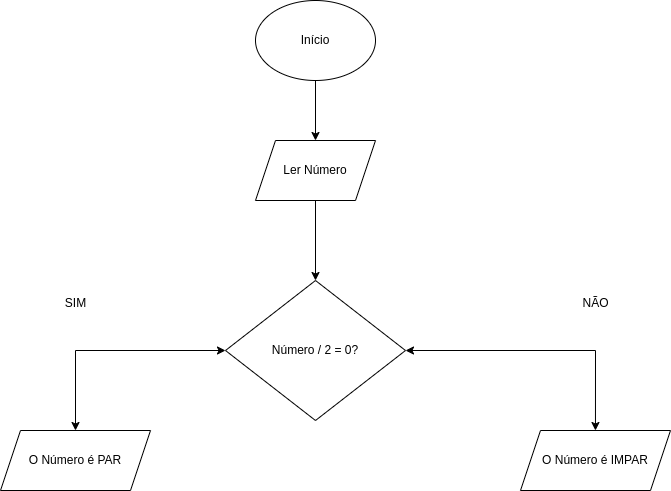

# 🧩 Aula 5: Algoritmos e Fluxogramas

## 💡 Reflexão Inicial

> "Se você não consegue explicar algo de forma simples, então você não entendeu bem o suficiente." — *Albert Einstein*

Desde as tarefas mais simples do dia a dia até os cálculos mais complexos da ciência e da tecnologia, a forma como organizamos os passos para resolver problemas define nossa eficiência e precisão. Os **algoritmos** são o coração do Pensamento Computacional, permitindo-nos criar sequências lógicas para solucionar desafios de forma estruturada. Para visualizar esses processos, utilizamos **fluxogramas**, que facilitam a interpretação e implementação de algoritmos.

------

## 🎯 Objetivos da Aula

Nesta aula, você irá aprender:

✅ O que são algoritmos e sua importância na resolução de problemas;

✅ Como representar algoritmos de forma clara e eficiente;

✅ O papel dos fluxogramas na visualização de processos;

✅ Aplicações práticas dos algoritmos e fluxogramas no cotidiano e na computação.

------

## 🔎 5.1. O que é um Algoritmo?

Um **algoritmo** é uma sequência **finita** e **ordenada** de passos utilizados para resolver um problema ou realizar uma tarefa. Ele pode ser descrito em linguagem natural, pseudocódigo, ou em uma linguagem de programação.

### 🔹 Características Fundamentais de um Algoritmo

Para que um algoritmo seja eficiente, ele deve possuir as seguintes características:

✔ **Definido**: Cada etapa deve ser clara e precisa, sem ambiguidades. ✔ **Finito**: Deve terminar após um número determinado de passos. ✔ **Ordenado**: As etapas devem seguir uma sequência lógica. ✔ **Executável**: Deve ser possível ser seguido e implementado. ✔ **Generalizável**: Deve funcionar para diferentes entradas de dados.

### 🔹 Exemplos Simples de Algoritmos

1️⃣ **Fazer um Café**

1. Ferva a água.
2. Coloque o pó de café no filtro.
3. Despeje a água quente sobre o pó de café.
4. Aguarde o café passar para o recipiente.
5. Sirva e aproveite!

2️⃣ **Determinar se um número é par ou ímpar** (Escrito em pseudocódigo):

```
Início
   Leia número
   Se número MOD 2 = 0 então
      Escreva "O número é par"
   Senão
      Escreva "O número é ímpar"
Fim
```

Neste exemplo, utilizamos uma estrutura condicional para determinar se um número é par ou ímpar.

------

## 📌 5.2. Como Representar Algoritmos?

Os algoritmos podem ser representados de diferentes formas:

1️⃣ **Linguagem Natural** → Descrição textual dos passos (como a receita de café).

2️⃣ **Pseudocódigo** → Utiliza uma estrutura próxima da programação para facilitar a escrita do algoritmo.

3️⃣ **Fluxogramas** → Diagramas gráficos que representam visualmente a lógica do algoritmo.

Entre essas opções, os **fluxogramas** são extremamente úteis, pois tornam mais fácil a compreensão e o refinamento dos algoritmos.

------

## 🔄 5.3. O que é um Fluxograma?

Um **fluxograma** é uma representação visual de um algoritmo, utilizando símbolos gráficos para ilustrar os passos do processo. Ele facilita a análise e a compreensão da lógica do algoritmo antes da implementação em código.

### 🔹 Ferramentas para Criar Fluxogramas

Uma excelente ferramenta gratuita para criar fluxogramas é o [**draw.io**](https://www.draw.io/). Ele permite a construção de diagramas de forma intuitiva, facilitando a organização e documentação de processos.

### 🔹 Principais Símbolos Utilizados em Fluxogramas

Os fluxogramas utilizam **símbolos padronizados** para representar diferentes operações dentro de um algoritmo. Aqui estão os mais importantes:

| Símbolo                 | Nome                   | Uso                                                          |
| ----------------------- | ---------------------- | ------------------------------------------------------------ |
| 🔘 **Elipse**            | Início/Fim             | Indica o início ou o fim do fluxo                            |
| 🔲 **Paralelogramo**     | Entrada/Saída          | Representa entrada de dados ou exibição de informações       |
| 🔷 **Losango**           | Decisão                | Utilizado para perguntas do tipo "Sim" ou "Não"              |
| 🔹 **Retângulo**         | Processo               | Representa operações, cálculos ou instruções                 |
| ➡ **Seta**              | Fluxo de Processo      | Indica a direção do fluxo                                    |
| 🔄 **Seta dupla**        | Conector de Fluxo      | Indica um retorno dentro do processo                         |
| 📦 **Cilindro**          | Armazenamento de Dados | Representa um banco de dados ou armazenamento em memória     |
| 📜 **Documento**         | Saída de Relatório     | Indica geração de documentos ou relatórios                   |
| 🔗 **Conector Circular** | Conector               | Usado para conectar partes do fluxograma quando ele se torna extenso |
| ⏳ **Loop**              | Repetição              | Representa processos que se repetem várias vezes             |

### 🔹 Exemplo de Fluxograma: Determinar se um número é par ou ímpar

📌 Abaixo está o diagrama representando o algoritmo para verificar se um número é par ou ímpar:



------

## 🏆 5.4. Aplicações de Algoritmos e Fluxogramas

Os algoritmos estão em **todas as áreas do conhecimento**, e os fluxogramas ajudam a visualizá-los. Vamos ver algumas aplicações:

### 🧮 **Matemática**

- Resolução de equações com algoritmos iterativos.
- Cálculo de médias e estatísticas utilizando passos definidos.

### 💻 **Computação**

- Algoritmos de busca e ordenação em bancos de dados.
- Inteligência Artificial: reconhecimento de padrões e aprendizado de máquina.

### ⚙ **Engenharia e Automação**

- Algoritmos controlam máquinas e processos industriais.
- Programação de robôs para tarefas repetitivas.

### 🎮 **Jogos Digitais**

- Inteligência artificial de NPCs (personagens não jogáveis) utiliza algoritmos para definir comportamentos.
- Física dos jogos (movimento de personagens, colisões) segue fluxogramas de cálculos matemáticos.

### 📊 **Economia e Finanças**

- Algoritmos calculam previsões de mercado.
- Fluxogramas modelam processos bancários para otimização de operações.

------

## 🚀 5.5. Algoritmos no Mundo Real

Os algoritmos impactam diretamente nossa vida, muitas vezes sem que percebamos. Veja alguns exemplos:

✔ **Redes Sociais:** Algoritmos determinam quais postagens aparecem no seu feed com base no seu comportamento online.

✔ **GPS e Mapas:** Algoritmos calculam a melhor rota levando em conta trânsito e tempo estimado.

✔ **Recomendações de Streaming:** Plataformas como Netflix e Spotify utilizam algoritmos para sugerir conteúdos baseados no seu histórico.

✔ **Segurança Digital:** Algoritmos de criptografia protegem suas senhas e dados bancários online.

------

## 📢 Conclusão

Os **algoritmos** são a base do Pensamento Computacional e podem ser representados por **fluxogramas**, facilitando a compreensão e visualização dos passos para resolver um problema. Esses conceitos são essenciais em diversas áreas, desde matemática e engenharia até inteligência artificial e jogos digitais.

Na próxima etapa, aplicaremos esse conhecimento em atividades práticas, onde você terá a oportunidade de criar seus próprios algoritmos e fluxogramas para solucionar desafios reais!
